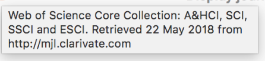

```{r global_options, include=FALSE}
knitr::opts_chunk$set(fig.width = 12, fig.height = 8, fig.path = 'figure/', echo = FALSE, warning = FALSE, message = FALSE, error = FALSE, eval = TRUE, tidy = TRUE, comment = NA)
```

```{r library, include=FALSE}
library(tidyverse)
```


<!-- # Sponsored by -->

<!-- [](https://www.modelistatistik.com/) -->


# Journals Published Articles From Turkey {.tabset .tabset-fade .tabset-pills}

If you want to see the code used in the analysis please click the code button on the right upper corner or throughout the page.  
Select from the tabs below.

---

## Aim 

**Aim:**

Here we will look at the Journals in which articles from Turkey are published. 

---

## Data retriveal from PubMed using EDirect 

Articles are downloaded as `xml`.


<!-- ```{r Search PubMed write 2018 data as xml, eval=FALSE, include=FALSE} -->
<!-- myTerm <- rstudioapi::terminalCreate(show = FALSE) -->
<!-- rstudioapi::terminalSend( -->
<!--     myTerm, -->
<!--     "esearch -db pubmed -query \"Turkey[Affiliation]\" -datetype PDAT -mindate 2018 -maxdate 3000 | efetch -format xml > data/Turkey_2018.xml \n" -->
<!-- ) -->
<!-- Sys.sleep(1) -->
<!-- repeat { -->
<!--     Sys.sleep(0.1) -->
<!--     if (rstudioapi::terminalBusy(myTerm) == FALSE) { -->
<!--         print("Code Executed") -->
<!--         break -->
<!--     } -->
<!-- } -->
<!-- ``` -->


```{r Search PubMed write all data as xml, eval=FALSE, include=FALSE}
myTerm <- rstudioapi::terminalCreate(show = FALSE)
rstudioapi::terminalSend(
    myTerm,
    "esearch -db pubmed -query \"Turkey[Affiliation]\" -datetype PDAT -mindate 1800 -maxdate 3000 | efetch -format xml > data/Turkey_all.xml \n"
)
Sys.sleep(1)
repeat {
    Sys.sleep(0.1)
    if (rstudioapi::terminalBusy(myTerm) == FALSE) {
        print("Code Executed")
        break
    }
}
```


<!-- ```{r Search PubMed get 2018 data on the fly, eval=FALSE, include=FALSE} -->
<!-- myTerm <- rstudioapi::terminalCreate(show = FALSE) -->
<!-- rstudioapi::terminalSend( -->
<!--     myTerm, -->
<!--     "esearch -db pubmed -query \"Turkey[Affiliation]\" -datetype PDAT -mindate 2018 -maxdate 3000 | efetch -format xml | xtract  -pattern PubmedArticle -element MedlineCitation/PMID PubDate/Year Journal/ISSN ISOAbbreviation> data/onthefly_Turkey_2018.csv \n" -->
<!-- ) -->
<!-- Sys.sleep(1) -->
<!-- repeat { -->
<!--     Sys.sleep(0.1) -->
<!--     if (rstudioapi::terminalBusy(myTerm) == FALSE) { -->
<!--         print("Code Executed") -->
<!--         break -->
<!--     } -->
<!-- } -->
<!-- ``` -->


<!-- ```{r Search PubMed get all data on the fly, eval=FALSE, include=FALSE} -->
<!-- myTerm <- rstudioapi::terminalCreate(show = FALSE) -->
<!-- rstudioapi::terminalSend( -->
<!--     myTerm, -->
<!--     "esearch -db pubmed -query \"Turkey[Affiliation]\" -datetype PDAT -mindate 1800 -maxdate 3000 | efetch -format xml | xtract  -pattern PubmedArticle -element MedlineCitation/PMID PubDate/Year Journal/ISSN ISOAbbreviation> data/onthefly_Turkey_all.csv \n" -->
<!-- ) -->
<!-- Sys.sleep(1) -->
<!-- repeat { -->
<!--     Sys.sleep(0.1) -->
<!--     if (rstudioapi::terminalBusy(myTerm) == FALSE) { -->
<!--         print("Code Executed") -->
<!--         break -->
<!--     } -->
<!-- } -->
<!-- ``` -->


Journal Names are extracted from xml.


<!-- ```{r extract journal names from 2018 xml, eval=FALSE, message=FALSE, warning=FALSE, include=FALSE} -->
<!-- myTerm <- rstudioapi::terminalCreate(show = FALSE) -->
<!-- rstudioapi::terminalSend( -->
<!-- myTerm, -->
<!-- "xtract -input data/Turkey_2018.xml -pattern PubmedArticle -element MedlineCitation/PMID PubDate/Year Journal/ISSN ISOAbbreviation > data/Turkey2018.csv \n" -->
<!-- ) -->
<!-- Sys.sleep(1) -->
<!-- repeat { -->
<!-- Sys.sleep(0.1) -->
<!-- if (rstudioapi::terminalBusy(myTerm) == FALSE) { -->
<!-- print("Code Executed") -->
<!-- break -->
<!-- } -->
<!-- } -->
<!-- ``` -->


```{r extract journal names from all data xml, message=FALSE, warning=FALSE}
myTerm <- rstudioapi::terminalCreate(show = FALSE)
rstudioapi::terminalSend(
myTerm,
"xtract -input data/Turkey_all.xml -pattern PubmedArticle -sep ' ' -def 'na' -element MedlineCitation/PMID Journal/ISSN ISOAbbreviation PubDate/Year > data/TurkeyAll.csv \n"
)
Sys.sleep(1)
repeat {
Sys.sleep(0.1)
if (rstudioapi::terminalBusy(myTerm) == FALSE) {
print("Code Executed")
break
}
}
```


----


## Retrieval of Data of Properties of Journals


[nlmcatalog_result_journals_pmc.xml](https://www.ncbi.nlm.nih.gov/portal/utils/file_backend.cgi?Db=nlmcatalog&HistoryId=NCID_1_69755278_130.14.18.97_5555_1534585934_3590606783_0MetA0_S_HStore&QueryKey=2&Sort=PubDate&Filter=all&CompleteResultCount=2559&Mode=file&View=xml&p$l=Email&portalSnapshot=%2Fprojects%2Fentrez%2Fpubmed%2FPubMedGroup@1.136&BaseUrl=&PortName=live&RootTag=NLMCatalogRecordSet&DocType=NLMCatalogRecordSet%20PUBLIC%20%22-%2F%2FNLM%2F%2FDTD%20NLMCatalogRecordSet,%201st%20June%202017%2F%2FEN%22%20%22https://www.nlm.nih.gov/databases/dtd/nlmcatalogrecordset_170601.dtd%22&FileName=&ContentType=xml)


[nlmcatalog_result_currentlyindexed.xml](https://www.ncbi.nlm.nih.gov/portal/utils/file_backend.cgi?Db=nlmcatalog&HistoryId=NCID_1_69755278_130.14.18.97_5555_1534585934_3590606783_0MetA0_S_HStore&QueryKey=1&Sort=PubDate&Filter=all&CompleteResultCount=5242&Mode=file&View=xml&p$l=Email&portalSnapshot=%2Fprojects%2Fentrez%2Fpubmed%2FPubMedGroup@1.136&BaseUrl=&PortName=live&RootTag=NLMCatalogRecordSet&DocType=NLMCatalogRecordSet%20PUBLIC%20%22-%2F%2FNLM%2F%2FDTD%20NLMCatalogRecordSet,%201st%20June%202017%2F%2FEN%22%20%22https://www.nlm.nih.gov/databases/dtd/nlmcatalogrecordset_170601.dtd%22&FileName=&ContentType=xml)


[scimagojr2017.csv](https://www.scimagojr.com/journalrank.php?out=xls)

[scimagojr2017-wos.csv](https://www.scimagojr.com/journalrank.php?wos=true&out=xls)





---


## Analysis

```{r Organize Journal Data 1, message=FALSE, warning=FALSE}
library(tidyverse)
library(readr)

TurkeyAll <- read_delim("data/TurkeyAll.csv", 
    "\t", escape_double = FALSE, col_names = FALSE,
    na = "na", trim_ws = TRUE)

names(TurkeyAll) <- c("PMID", "ISSN", "JournalName", "Year")

# dim(TurkeyAll)[1]

# min(TurkeyAll[,4], na.rm = TRUE)

# max(TurkeyAll[,4], na.rm = TRUE)

# glimpse(TurkeyAll)

```


```{r Organize Journal Data 2}
uniqueJournals <- TurkeyAll %>% 
    select(JournalName, ISSN) %>% 
    unique()

# dim(uniqueJournals)[1]

```


```{r Organize Journal Data 3}

TurkeyAll2 <- TurkeyAll %>% 
    mutate(Journal = paste(JournalName, ISSN, sep = " ISSN "))

ArticlesByYear <- TurkeyAll2 %>% 
    group_by(Journal, Year) %>% 
    summarise(n = n())

ArticlesByYear <- ArticlesByYear %>% 
    spread(key = Year, value = n)

TurkeyAll2 <- TurkeyAll2 %>% 
    select(Journal, JournalName, ISSN) %>% 
    unique()
    
ArticlesByYear <- left_join(ArticlesByYear, TurkeyAll2, by = "Journal") 

ArticlesByYear <- ArticlesByYear %>%
    select(
    Journal, JournalName, ISSN, everything()
    )

```


```{r scimagojr2017}

```


-element MedlineTA  NLMCatalogRecord/NlmUniqueID -def 'na' -sep '\t' -block TitleAlternate/Title   -element TitleAlternate/Title   

"xtract -input data/nlmcatalog_result_currentlyindexed.xml -pattern NCBICatalogRecord -element ISSNLinking -def 'na' -sep ' ' -block TitleAlternate/Title -if TitleAlternate/Title@Sort -equals N -element TitleAlternate/Title  > data/nlmcatalog.csv \n"

-sep '\t' 


NLMCatalogRecord/NlmUniqueID ISSNLinking

```{r nlmcatalog, message=FALSE, warning=FALSE}
myTerm <- rstudioapi::terminalCreate(show = FALSE)
rstudioapi::terminalSend(
myTerm,
"xtract -input data/nlmcatalog_result_currentlyindexed.xml -pattern NCBICatalogRecord -tab '|' -element NLMCatalogRecord/NlmUniqueID -block ISSNLinking -tab '|' -element ISSNLinking -block Title -if Title@Sort -equals N -def 'na' -tab '|' -element TitleAlternate/Title > data/nlmcatalog.csv \n"
)
Sys.sleep(1)
repeat {
Sys.sleep(0.1)
if (rstudioapi::terminalBusy(myTerm) == FALSE) {
print("Code Executed")
break
}
}

``` 


```{r}
library(readr)
nlmcatalog <- read_delim("data/nlmcatalog.csv", 
                         delim = "|",
                         escape_double = FALSE,
                         col_names = FALSE, 
                         trim_ws = TRUE)

```

```{r}

library(xml2)
data <- read_xml("data/nlmcatalog_result_currentlyindexed.xml")

# Point locations
point <- data %>% xml_find_all("//pointer")
point %>% xml_attr("latitude") %>% as.numeric()
point %>% xml_attr("longitude") %>% as.numeric()

# Start time
data %>% 
  xml_find_all("//start-valid-time") %>% 
  xml_text()

# Temperature
data %>% 
  xml_find_all("//temperature[@type='hourly']/value") %>% 
  xml_text() %>% 
  as.integer()


```


---

## Results

- PubMed'de **`r min(TurkeyAll[,4], na.rm = TRUE)`-`r max(TurkeyAll[,4], na.rm = TRUE)`** tarihleri arasında, *Türkiye* adresli **`r dim(TurkeyAll)[1]`** adet yayın mevcuttur.

- PubMed'de **`r min(TurkeyAll[,4], na.rm = TRUE)`-`r max(TurkeyAll[,4], na.rm = TRUE)`** tarihleri arasında, *Türkiye* adresli yayınlar **`r dim(uniqueJournals)[1]`** farklı dergide yayımlanmıştır.


---

## Discussion

türkiye adresli olup da pubmedde yer alan makaleler hangi dergilerde kaçar adet yayınlanmış


The retrieved information was compiled in a table.


**Methods:**


**Result:**


```{r plot 1}
ggplot(data = articles_per_journal, aes(x = Journal, y = n, group = Country,
                                     colour = Country, shape = Country,
                                     levels = Country
)) +
    geom_point() +
    labs(x = "Journals with decreasing impact factor", y = "Number of Articles") +
    ggtitle("Pathology Articles Per Journal") + 
    theme(plot.title = element_text(hjust = 0.5),
          axis.text.x=element_blank())

```


**Comment:**


---


## Feedback

[Serdar Balcı, MD, Pathologist](https://github.com/sbalci) would like to hear your feedback: https://goo.gl/forms/YjGZ5DHgtPlR1RnB3

This document will be continiously updated and the last update was on `r Sys.Date()`.

---

## Back to Main Menu

[Main Page for Bibliographic Analysis](https://sbalci.github.io/pubmed/BibliographicStudies.html)

---